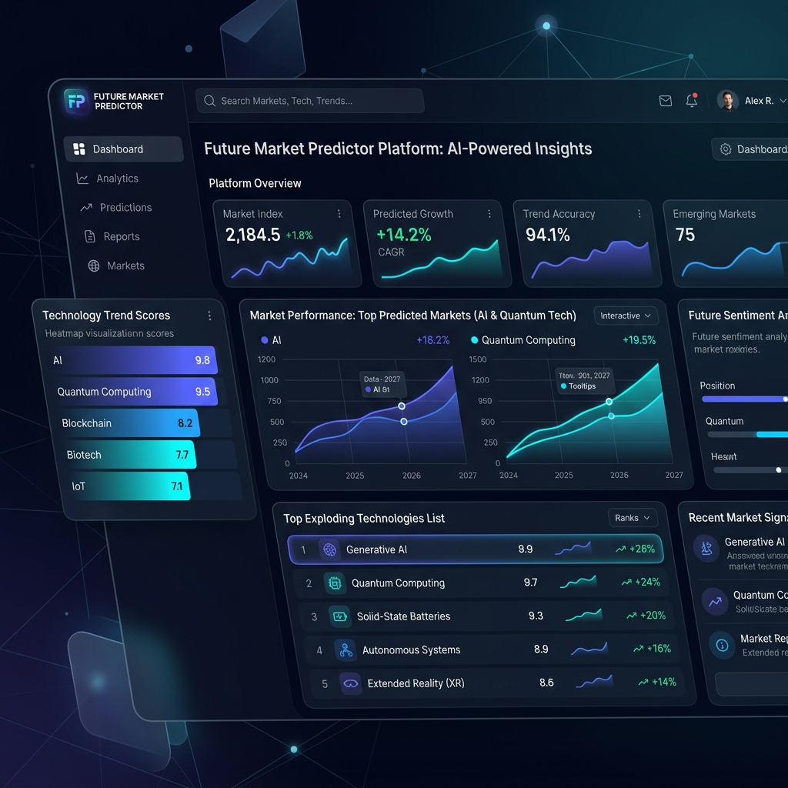
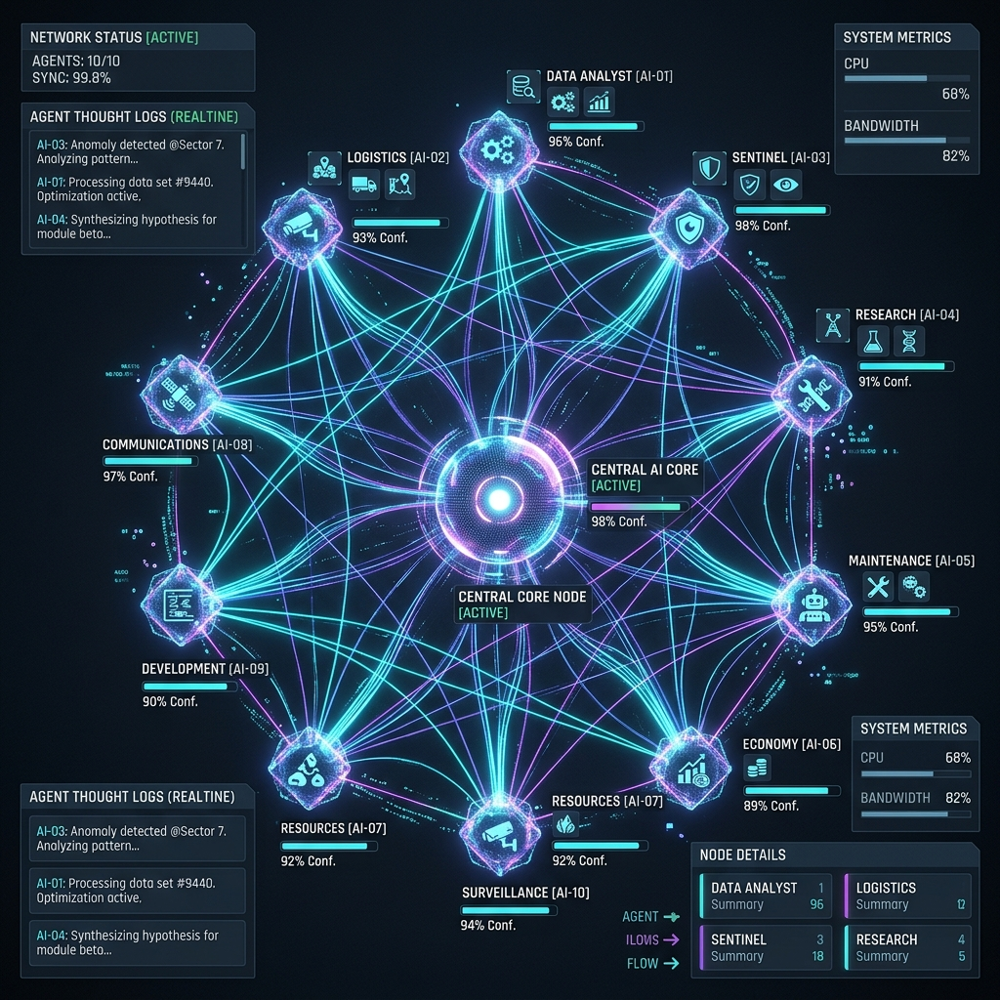
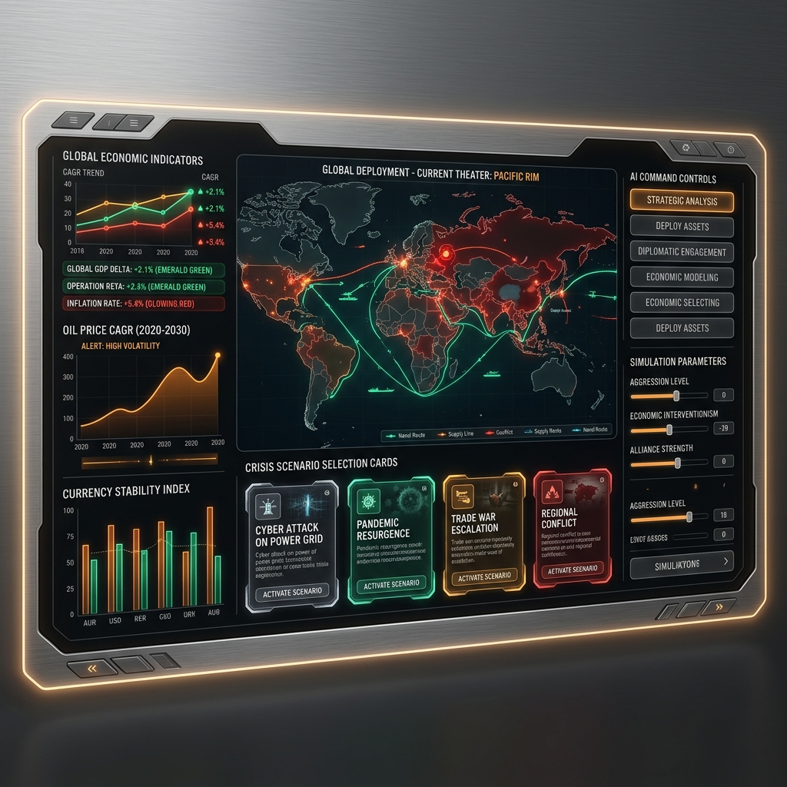
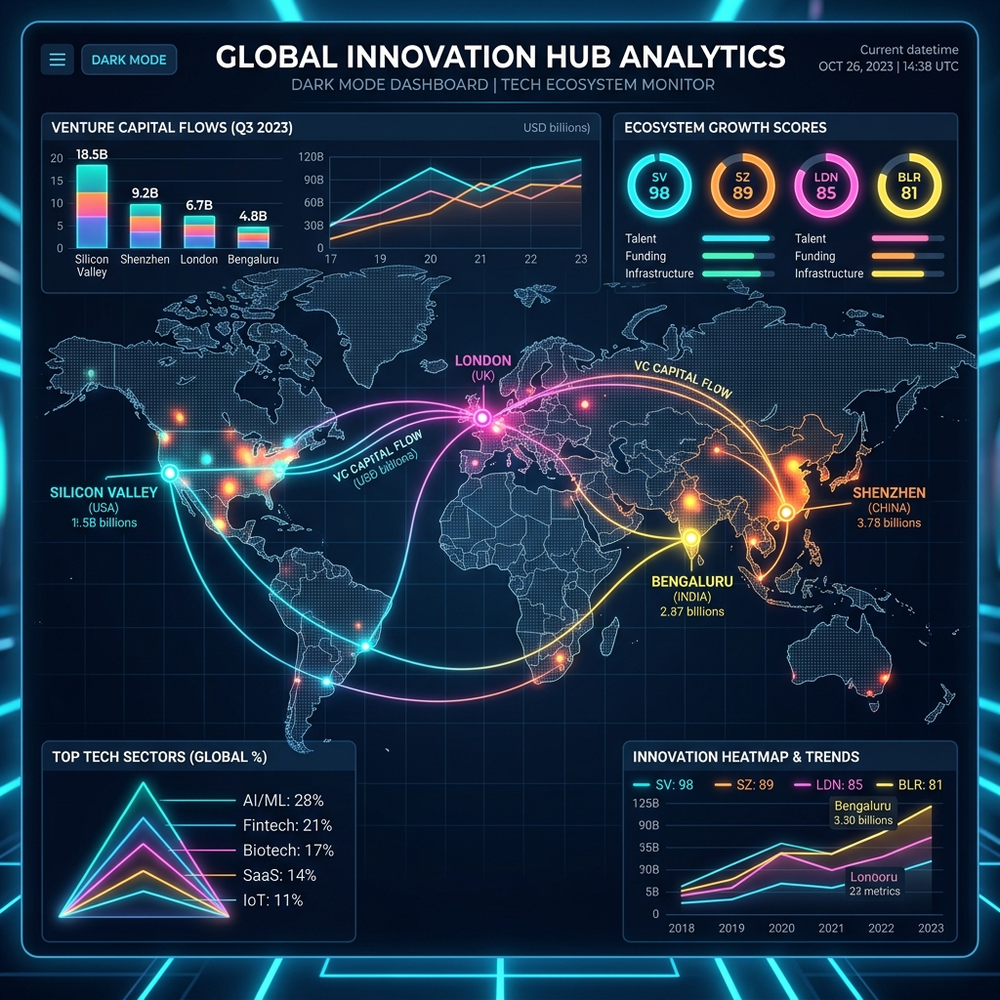
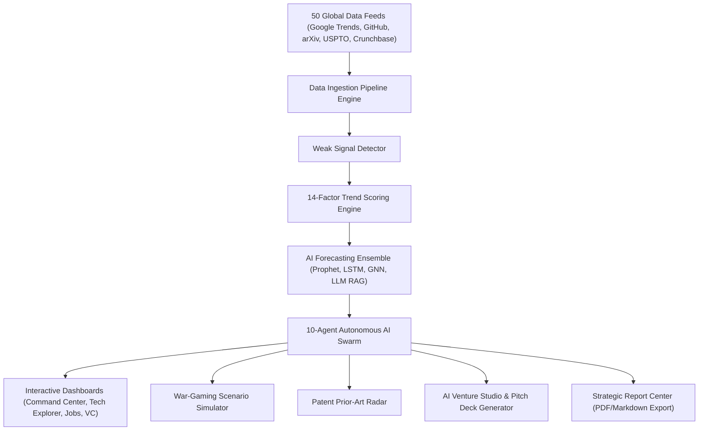

# Future Market Predictor Platform 🔮🚀

[](LICENSE)
[](https://github.com/vijaymahes9080/Future-Market-Predictor-Platform/actions)
[](https://reactjs.org/)
[](https://vitejs.dev/)
[](https://www.typescriptlang.org/)
[](#3--10-specialized-autonomous-ai-agents)
[](#-50-global-data-source-ingestion-pipelines)

> An **industry-grade Future Market Predictor Platform** that continuously ingests global data across 50 sources, detects weak signals, computes 14-dimensional trend scores, runs multi-model AI time-series predictions (6m, 1y, 3y, 5y, 10y), forecasts future workforce demand, discovers high-ROI startup opportunities, and powers a 10-agent AI swarm network.



---

## 🌟 Key Features & Innovation Modules

### 1. ⚡ Command Center & Multi-Horizon Predictor
- Executive dashboard tracking **35+ cutting-edge technology sectors** (Agentic AI, Humanoid Robotics, Quantum Computing, Fusion Energy, Synthetic Biology, BCI, Spatial Computing, 6G, Smart Materials, Edge AI, ClimateTech, etc.).
- Projections across **5 Time Horizons**: `6 Months`, `1 Year`, `3 Years`, `5 Years`, and `10 Years`.
- Live **Weak Signal Alert Radar** capturing patent surges, arXiv paper clusters, and GitHub repo velocity.

### 2. 📊 14-Factor Trend Scoring Engine
Every technology sector is continuously evaluated across 14 normalized quantitative metrics (0-100):
1. **Innovation Score**
2. **Market Score**
3. **Patent Score**
4. **Research Score**
5. **Funding Score**
6. **Developer Score**
7. **Community Score**
8. **Startup Score**
9. **Enterprise Score**
10. **Investment Score**
11. **Commercial Score**
12. **Future Potential Score**
13. **Risk Score**
14. **Overall Opportunity Score**

### 3. 🤖 10 Specialized Autonomous AI Agents



- **AI Market Intelligence Agent**: Global tech & market scanner.
- **Patent Intelligence Agent**: IP claims miner & prior-art analyzer.
- **Research Intelligence Agent**: Academic paper & citation graph miner.
- **Startup Intelligence Agent**: Y Combinator & Product Hunt accelerator scout.
- **Investment Intelligence Agent**: PitchBook & Crunchbase VC funding tracker.
- **News Intelligence Agent**: Global sentiment & press signal filter.
- **GitHub Intelligence Agent**: Open-source repository velocity & commit tracker.
- **Trend Prediction Agent**: Multi-horizon time-series forecaster.
- **Future Jobs Agent**: Workforce automation risk & skill evolution modeler.
- **Business Opportunity Agent**: Market gap & B2B/B2C SaaS matrix generator.

### 4. 🎮 AI War-Gaming & Macroeconomic Scenario Simulator



- Run "What-If" macroeconomic and technological shock scenarios (*AGI Breakthrough 2027*, *Commercial Fusion Power Grid 2030*, *Quantum RSA-2048 Threat*).
- Calculates real-time CAGR deltas, workforce impact vectors, portfolio hedges, and enterprise playbooks.

### 5. 📜 Autonomous Patent Prior-Art & Claims Radar
- Deep IP claims parser across **USPTO**, **WIPO**, **EPO**, **JPO**, and **CNIPA**.
- Computes Novelty Ratings (0-100), litigation risk indices, prior-art citation counts, and key independent claims.

### 6. 🚀 AI Venture Studio & 10-Slide Pitch Deck Generator
- Transforms discovered market gaps into a full **10-slide VC Pitch Deck outline**.
- Computes **TAM/SAM/SOM market sizing** ($120B TAM), unit economics (84% gross margins, 7-month CAC payback), and competitive moat ratings.

### 7. 📅 2026 - 2035 Interactive Technology Milestone Roadmap
- Visual Gantt-style timeline mapping milestone breakthrough targets, adoption stage shifts, and disruption potential per year (`2026`, `2027`, `2028`, `2030`, `2032`, `2035`).

### 8. 💻 Multi-Agent Prompt & Reasoning Sandbox
- Dispatch custom queries to tailored agent teams.
- Adjust reasoning depth (`Standard`, `Deep Research`, `Exhaustive Graph Mining`) and inspect real-time agent execution trace trees.

### 9. 🌐 Global Innovation Hubs Geospatial Heatmap



- Ecosystem breakdown of top global tech capitals (**San Francisco**, **Shenzhen**, **London**, **Bengaluru**, **Munich**, **Tel Aviv**).
- Tracks VC flow YTD, ecosystem scores, patent filing velocity, and feeder universities.

---

## 🛠️ System Architecture



---

## 📡 50 Global Data Source Ingestion Pipelines

The platform ingests data across 6 primary categories:
1. **Search & Social**: Google Trends, Google Search, Google News, Bing News, Reddit, Hacker News, X/Twitter, LinkedIn.
2. **Open Source & Dev**: GitHub API, GitLab, Stack Overflow, Kaggle.
3. **Academic & Papers**: arXiv, IEEE Xplore, ACM Digital Library, Semantic Scholar, SSRN, OpenAlex, CrossRef, Nature, Science.
4. **Patents & IP**: Google Patents, USPTO Gazette, WIPO PATENTSCOPE, European Patent Office.
5. **VC & Financial**: Crunchbase, PitchBook, Y Combinator, Product Hunt, Wellfound, CB Insights, Statista, Gartner, McKinsey, Deloitte, PwC, BCG, IDC.
6. **Government & Global**: NASA Open Data, ESA Space Solutions, ISRO, WHO, World Bank, OECD, IMF, Government Innovation Portals.

---

## ⚙️ Installation & Quickstart

### Prerequisites
- **Node.js**: `v18.0.0` or higher
- **npm**: `v9.0.0` or higher

### Steps

1. **Clone the Repository**
   ```bash
   git clone https://github.com/vijaymahes9080/Future-Market-Predictor-Platform.git
   cd Future-Market-Predictor-Platform
   ```

2. **Install Dependencies**
   ```bash
   npm install
   ```

3. **Start Development Server**
   ```bash
   npm run dev
   ```
   Open `http://localhost:3000` in your browser.

4. **Build Production Bundle**
   ```bash
   npm run build
   ```

---

## 📄 License

This project is licensed under the [MIT License](LICENSE) - see the LICENSE file for details.

Developed with ❤️ by **Vijay Mahes** (`Vijaypradhap2004@gmail.com`).
